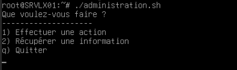
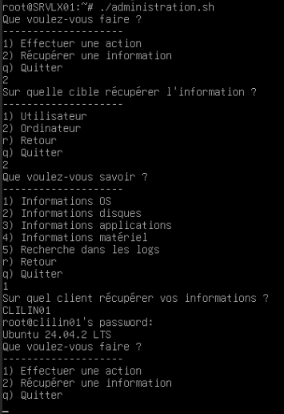
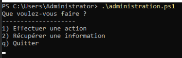
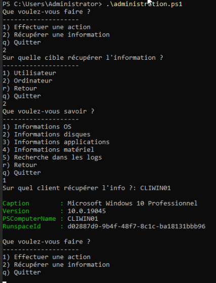

# 🖥️ GUIDE D'UTILISATION

## ⚙️ Généralités

Le script d'administration à distance dispose des mêmes fonctionnalités sur Debian et Windows. En raison des différences entre ces deux OS, des différences peuvent exister entre les sorties exactes. 

Les menus sont cependant identiques.

Lorsque vous avez lancé le script, on vous demande de choisir si vous voulez effectuer une action d'administration, ou récupérer une information. Ensuite, on vous demande si votre cible est un utilisateur ou un ordinateur. Finalement, on vous demandera quelle fonctionnalité vous souhaitez utiliser exactement.

A chaque fois, on vous demandera d'entrer l'ordinateur que vous souhaitez cibler, et, le cas échéant, l'utilisateur.

> Pour chaque information que vous récupérez, le script les affiche sur l'écran. Il les garde également en mémoire dans un dossier **log** situé au même endroit que le script par défaut. De plus, chacune de vos actions est conservées dans un fichier **log_evt.log**.

Dans les sous-menus du script, il est possible de revenir en arrière en apuyant sur **r**.

Dans les menus et sous-menus du script, il est possible de quitter le script en appuyant sur **q**. Tant que vous n'avez pas quitté le script ainsi, il continuera à tourner afin que vous puissiez réaliser plusieurs actions durant la même exécution.

## 🐧 Utilisation Linux  

Pour utiliser ce script, il faut être connecté en tant que **root**.

Le script s'exécute directement depuis le terminal. 

> Par défaut, le script est dans le dossier courant de l'utilisateur root, c'est à dire **/root**. Il est donc accessible directement lorsqu'on se connecte en temps que **root**.

Lorsque que vous êtes dans le même dossier que le script, lancer la commande suivante pour executer le script "administration.sh" :

```bash
./administration.sh
```

Si tout se passe bien, les lignes suivantes devraient s'afficher :

 

Vous n'avez ensuite plus qu'à naviguer dans les menus pour effectuer les actions d'administration de votre choix, ou récupérer les informations qui vous intéressent.

Voici par exemple à quoi peut ressembler le parcours des menus lorsque vous souhaitez obtenir la version de l'OS du PC **CLIWIN01**:



## 🪟 Utilisation Windows

Pour utiliser ce script, il faut être connecté en temps que **Administrator**.

Le script s'exécute depuis un terminal **PowerShell (version 7)**.

> Par défaut, le script est dans le dossier courant de l'utilisateur **Administrator**, c'est à dire **C:\Users\Administrator**. Il est donc accessible directement lorsqu'on se connecte en temps que **root**.

Lorsque que vous êtes dans le même dossier que le script "administration.ps1", lancer la commande suivante :

```PowerShell
.\administration.ps1
```

Si tout se passe bien, les lignes suivantes devraient s'afficher :

 

Vous n'avez ensuite plus qu'à naviguer dans les menus pour effectuer les actions d'administration de votre choix, ou récupérer les informations qui vous intéressent.

Voici par exemple à quoi peut ressembler le parcours des menus lorsque vous souhaitez obtenir la version de l'OS du PC **CLIWIN01**:



## ❓ FAQ

#### Comment installer les script ?

Les scripts sont déjà présents sur les machines serveur. Les machines sur lesquelles vous pouvez les utiliser sont déjà configurées. Pour en savoir plus, vous pouvez consulter **INSTALL.md**.

#### Faut-il configurer des droits ou des permissions spécifiques ?

Les scripts déjà présents sur les machines serveur ont le droit de s'exécuter, vous ne devriez rien avoir à faire de plus. Les cas échéant, vous pouvez utiliser les commandes [chmod](https://www.ionos.fr/digitalguide/serveur/know-how/attribution-de-droits-sur-un-repertoire-avec-chmod/) sur Linux et [Unblock-File](https://learn.microsoft.com/en-us/powershell/module/microsoft.powershell.utility/unblock-file?view=powershell-7.5) sur Windows.

#### Comment ajouter de nouveaux hôtes cibles ?

L'ajout de nouveaux hôtes doit se faire en ajoutant des machines sur le réseau, et en les configurant afin qu'elles soient sur le même réseau. Une fois cela fait, il faut encore configurer certains éléments sur la nouvelle machine, dépendant de son OS. Ces éléments de configuration sont détaillés dans **INSTALL.md**

#### Comment sont gérées les connexions SSH ?

En l'état, les machines Windows sont configurées pour se connecter automatiquement. Elles ne requierrent pas l'utilisation de mots de passe.
Sur Linux, il faut entrer le mot de passe du compte utilisateur (ou le cas échéant root) lorsque vous lancez des commandes.

#### Le script stocke-t-il des identifiants ? Si oui, où et comment sont-ils protégés ?

Le script ne stocke aucune données d'identifiants.
